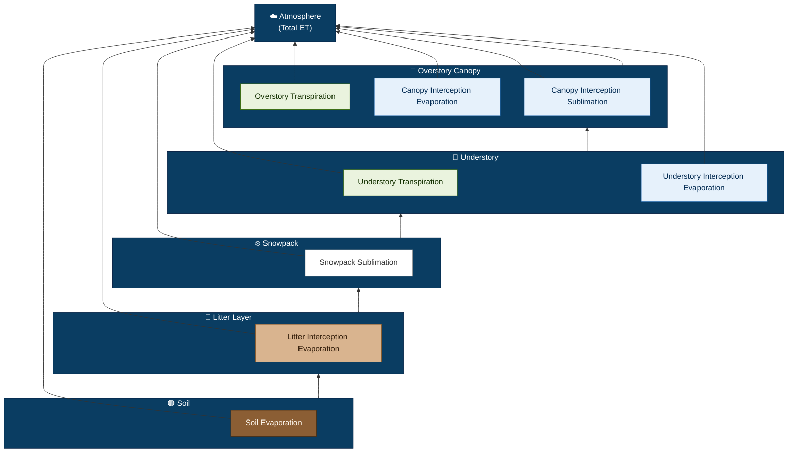

name: Evapotranspiration
aliases: [ET, evapotranspiration, total surface water loss]
type: flux
cycle: water
symbol: ET_t
units:  volume/time; depth/time
typical_range: [0, 0.010] mm/day
tags: [flux, evapotranspiration, hydrology,  vegetation, canopy, soil, litter]

## Description/Conceptual model

Evapotranspiration (ET) represents the combined loss of water to the atmosphere through plant transpiration and evaporation from soil, litter, and canopy surfaces. 
Evapotranspiration rates depend on water availability, energy availability and diffusion gradients    

# Basic Physical Model/Theory

**ET = T_overstory + T_understory + E_canopy_overstory + E_canopy_understory + E_litter + E_soil**

Where:

- T_overstory = Overstory [[process_transpiration]]
    
- T_understory = Understory[[process_transpiration]]
    
- E_canopy_overstory = Overstory canopy interception evaporation
    
- E_canopy_understory = Understory canopy interception evaporation
    
- E_litter = Litter evaporation
    
- E_soil = Soil evaporation
    

For all E and T, Penman-Monteith describes how available energy, water and diffusion gradients  influence ET 

\[ E' = \frac{\Delta (R_n - G) + \rho_a c_p \text{VPD} / r_a}{\Delta + \gamma (1 + r_s/r_a)} \]

For open water (including  interception ) E  = min(E', available water)

Where:
- \( E \): transpiration (mm/day)
- \( \Delta \): slope of saturation vapor pressure curve
- \( R_n \): net radiation
- \( G \): soil heat flux (often 0 for daily timestep)
- \( \rho_a \): air density
- \( c_p \): specific heat of air
- VPD: vapor pressure deficit
- \( r_a \): aerodynamic resistance
- [[flux_stomatal_conductance]]\( r_s \): surface resistance ( 1/ stomatal conductance for plants, median conductivity for mediums (soil, litter) )
- \( \gamma \): psychrometric constant

# Theory Reference

- Monteith, J. L. (1965). Evaporation and environment. _Symposia of the Society for Experimental Biology_, 19, 205-234.

## Model References

# General (physically-based, hybrid, statistical)

Wang, Kaicun, and Robert E. Dickinson. "A review of global terrestrial evapotranspiration: Observation, modeling, climatology, and climatic variability." _Reviews of Geophysics_ 50, no. 2 (2012). #foundational

McMahon, T. A., B. L. Finlayson, and M. C. Peel. "Historical developments of models for estimating evaporation using standard meteorological data." _Wiley Interdisciplinary Reviews: Water_ 3, no. 6 (2016): 788-818. #foundational

Yang, Yuting, Michael L. Roderick, Hui Guo, Diego G. Miralles, Lu Zhang, Simone Fatichi, Xiangzhong Luo et al. "Evapotranspiration on a greening Earth." _Nature Reviews Earth & Environment_ 4, no. 9 (2023): 626-641. #updatedreview

Pan, Shufen, Naiqing Pan, Hanqin Tian, Pierre Friedlingstein, Stephen Sitch, Hao Shi, Vivek K. Arora et al. "Evaluation of global terrestrial evapotranspiration using state-of-the-art approaches in remote sensing, machine learning and land surface modeling." _Hydrology and earth system sciences_ 24, no. 3 (2020): 1485-1509. #updatedreview

## Physically-based

# Statistical/ML

## Hybrid

# Observations

[[output_et]]

# Target ESMs

## RHESSys

Target ESM: RHESSys, [https://github.com/RHESSys/RHESSys.git](https://github.com/RHESSys/RHESSys.git), develop branch
depends_on:
    - [[flux_soil_evaporation]]]
    - [[flux_litter_evaporation]]
    - overstory transpiration
    - understory transpiration
    - overstory interception evaporation
    - understory interception evaporation

For all the Penman-Monteith is used - see individual fluxes for details
- Tague, C. & Band, L. (2004). RHESSys: Regional Hydro-Ecologic Simulation System—An Object-Oriented Approach to Spatially Distributed Modeling of Carbon, Water, and Nutrient Cycling. _Earth Interactions_, 8(19), 1-42. [https://doi.org/10.1175/1087-3562(2004)8](https://doi.org/10.1175/1087-3562\(2004\)8)<1:RRHSSO>2.0.CO;2
    
    
