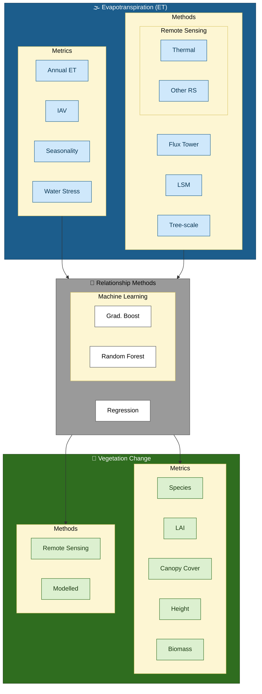

Studies vary in how vegetation changes is estimated (or modelled) and metrics used to summarize 'vegetation' change and similarly how evapotranspiration or streamflow change change is estimated or modelled and metrics used to summarizes change (e.g annual versus monthly evapotranspiration). Studies also vary across scale.  Different approach are used to describe the relationship - from  estimates of elasticity or sensitivity to predictive models of the change in ET with change in vegetation. 

