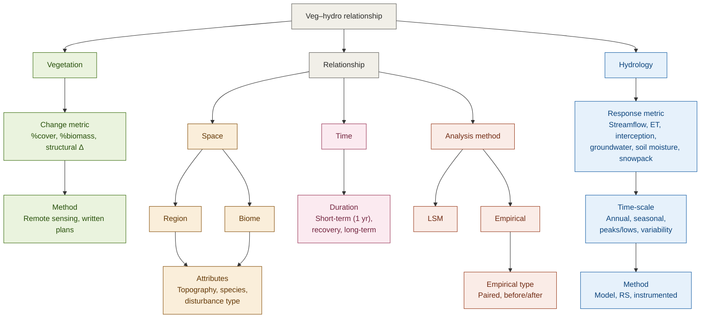

# Conceptual Model

It is well established that vegetation loss (through mortality, thinning, fuel treatment, fire) or gain (afforestation, growth)  impacts the water cycle - through by altering transpiration and evaporation (through canopy interception and shading and longwave impacts on surface evaporative fluxes), feedbacks to climate, changing infiltration and snowmelt.

# Methods used to quantify relationship

Below are some summaries of available studies organized by different categries - click on metric to see available studies and for some metrics summaries of relationship between vegetation change and hydrologic response

## Studies by response metric

## Studies by vegetation change metric

# Summary of Watershed Studies

## Histogram by climate category

## Histogram by biome

# Summary of Global and Regional Studies

Global and regional syntheses ask a different question than the paired-watershed
studies above. Rather than a discrete, locally-imposed change in forest cover
(harvest, thinning, fire, afforestation) at a gauged catchment, these studies
estimate a broad-scale trend in a hydrologic flux — typically from remotely
sensed or model-reconstructed products — and then attribute some fraction of
that trend to gradual, diffuse vegetation change (greening, expressed as a
change in LAI). Because the vegetation "treatment" is neither controlled nor
sharply bounded in space or time, attribution rests on regression or on
simulation experiments rather than on a before/after or paired-catchment
contrast, and the reported effect is a share of a trend rather than a percent
change in response to a percent change in cover.

The estimates below therefore aren't directly comparable to the watershed
numbers: they differ in the vegetation metric (LAI vs. % cover/basal area), in
how the hydrologic response is measured (multi-product ensembles or coupled
model output vs. gauged streamflow), and in what "attribution" means.

## Global and regional trend estimates
